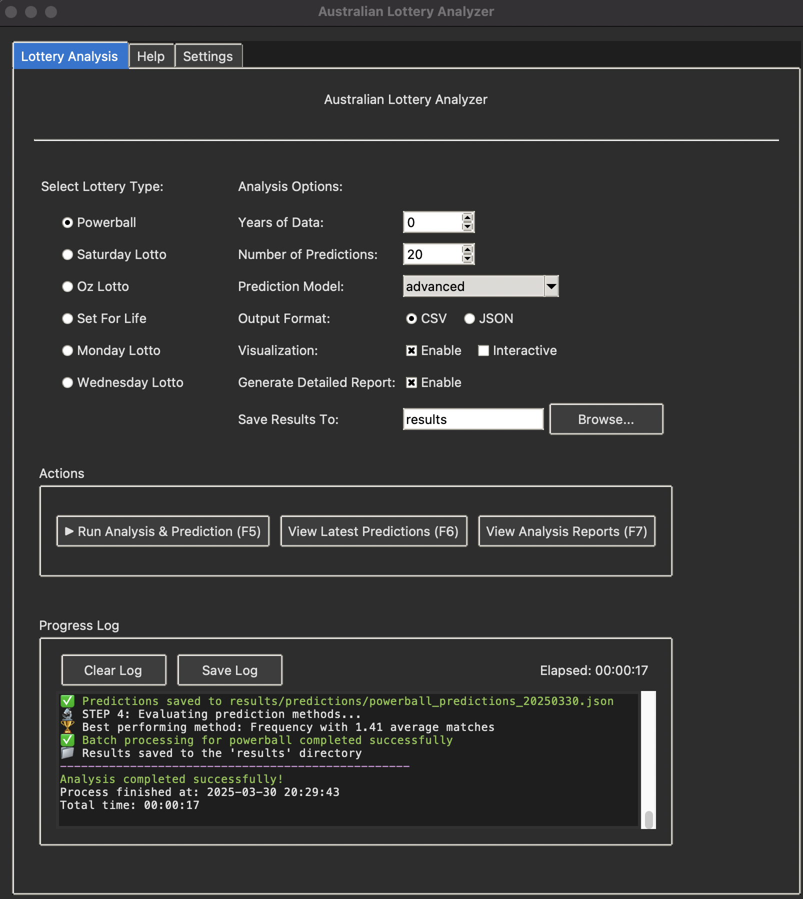

# Australian Lottery Analysis System

A comprehensive tool for analyzing lottery data, visualizing patterns, and generating predictions for various Australian lottery games.

## 📋 Features

- **Multi-Lottery Support**: Analyzes Saturday Lotto, Powerball, Oz Lotto, Monday Lotto, and Wednesday Lotto
- **Data Collection**: Scrapes historical lottery data from official sources
- **Robust Analysis**: Frequency analysis, pattern detection, and trend visualization
- **Prediction Generation**: Statistical models to generate potential number combinations
- **Visualization**: Charts and heatmaps showing number frequencies and patterns
- **Data Management**: Import, export, and merge historical lottery datasets
- **GUI Interface**: User-friendly graphical interface for easy analysis and prediction

## 🚀 Installation

```bash
# Clone the repository
git clone https://github.com/yourusername/lottery-analysis.git
cd lottery-analysis

# Install dependencies
pip install -r requirements.txt
```

### Prerequisites

- **Firefox Browser**: Required for web scraping functionality
  - **macOS**: `brew install --cask firefox` or download from [Firefox website](https://www.mozilla.org/firefox/new/)
  - **Windows**: Download and install from [Firefox website](https://www.mozilla.org/firefox/new/)
  - **Linux**: Use your distribution's package manager (e.g., `sudo apt install firefox`)

- **Python 3.7+**: Required for running the application

## 📁 Project Structure

```
lotto_analysis/
├── lotto_cli.py          # Command-line interface
├── lotto_core.py         # Core lottery definitions and validators
├── lotto_data_manager.py # Data processing and storage
├── lotto_scraper.py      # Web scraping functionality
├── lotto_analytics.py    # Advanced analysis and prediction algorithms
├── lotto_gui.py          # GUI interface
├── historical/           # Historical lottery data
│   ├── monday_lotto.csv
│   ├── oz_lotto.csv
│   ├── powerball.csv
│   ├── saturday_lotto.csv
│   └── wednesday_lotto.csv
└── results/              # Generated outputs
    ├── historical/       # Processed historical data
    ├── predictions/      # Generated number predictions
    └── analysis/         # Analysis reports and visualizations

```

## 🔧 Usage

### Graphical User Interface (GUI)
```bash
# Launch the GUI application
python3 lotto_gui.py
```



The GUI provides a comprehensive interface with the following features:
- Select from six Australian lottery types
- Specify how many years of historical data to analyze
- Control the number of predictions to generate
- Choose prediction model (frequency, time-weighted, pattern, or advanced ensemble)
- Select output format (CSV or JSON)
- Enable/disable visualizations and interactive charts
- Generate detailed analysis reports
- View real-time progress and color-coded logs during processing
- Save logs to a file for future reference
- Keyboard shortcuts for common actions (F5, F6, F7, Ctrl+S)
- Tooltips explaining the purpose of each option
- Custom output directory selection
- Help tab with detailed instructions

### Key GUI Features:
- **Color-coded logs**: Different colors for info, warnings, errors, and success messages
- **Real-time progress display**: See the analysis progress as it happens
- **Elapsed time tracking**: Monitor how long the analysis has been running
- **Intuitive layout**: Organized interface with clear sections
- **Tooltips**: Hover over elements to see explanations
- **Keyboard shortcuts**: Quick access to common functions

### Command Line Interface

### Import Historical Data
```bash
python3 lotto_cli.py --lottery saturday_lotto --action import
```

### Scrape Recent Data
```bash
python3 lotto_cli.py --lottery saturday_lotto --action scrape --years 5
```

**Note**: The scraping functionality requires Firefox to be installed on your system. For some regions (especially QLD), you may see a message that the lottery is not available in your state. The scraper will automatically attempt to switch to another state (NSW by default).

### Analyze Lottery Patterns
```bash
# Text-only analysis output to console
python3 lotto_cli.py --lottery saturday_lotto --action analyze

# Generate visualizations (charts, heatmaps, etc.)
python3 lotto_cli.py --lottery saturday_lotto --action analyze --visualize

# Generate interactive visualizations
python3 lotto_cli.py --lottery saturday_lotto --action analyze --visualize --interactive
```

### Generate Predictions
```bash
# Default 10 predictions in CSV format
python3 lotto_cli.py --lottery saturday_lotto --action predict

# Custom number of predictions in JSON format
python3 lotto_cli.py --lottery saturday_lotto --action predict --prediction-count 20 --format json

# Use specific prediction model
python3 lotto_cli.py --lottery saturday_lotto --action predict --model time_weighted
```

### Evaluate Prediction Models
```bash
# Compare performance of different prediction models
python3 lotto_cli.py --lottery saturday_lotto --action evaluate
```

### Batch Processing
```bash
# Run complete workflow: scrape, analyze, predict, evaluate
python3 lotto_cli.py --lottery saturday_lotto --action batch

# Historical Data + With Latest Data (last 2 Years)
python3 lotto_cli.py --lottery powerball --action batch --years 2
```

## 📊 Analysis Features

- Number frequency analysis
- Hot and cold number identification
- Number pair correlation detection
- Time-based pattern analysis
- Visualization through heatmaps and charts
- Statistical randomness testing
- Number cluster detection using machine learning
- Time-series decomposition for trend analysis

## 📈 Results

### Analysis Results
- **Detailed Text Reports**: Comprehensive analysis with statistics, patterns, and recommendations (`results/analysis/reports/lottery_type_detailed_analysis_YYYYMMDD.txt`)
- **Frequency Reports**: Visualizations of number frequencies as heatmaps and bar charts (`results/analysis/frequency_reports/`)
- **Temporal Analysis**: Time-series charts showing draw patterns and trends (`results/analysis/temporal_analysis/`)
- **Number Distribution**: Charts showing the distribution of drawn numbers across the possible range
- **Common Pairs**: Reports on frequently occurring number pairs
- **Interactive Visualizations**: Web-based interactive charts for detailed exploration (`results/analysis/interactive/`)
- **JSON Data**: Machine-readable structured data for further analysis (`results/analysis/reports/lottery_type_analysis_YYYYMMDD.json`)

### Prediction Results
- **CSV Format**: Structured predictions with probabilities, confidence scores, and prediction method (`results/predictions/lottery_type_YYYYMMDD.csv`)
- **JSON Format**: Detailed prediction data with metadata (`results/predictions/lottery_type_YYYYMMDD.json`)
- **Model Evaluation**: Performance reports comparing prediction methods (`results/analysis/evaluation/`)

### Historical Data
- **Combined Data**: Merged historical datasets (`results/historical/combined_results.csv`)
- **Individual Files**: Processed lottery-specific data files (`results/historical/individual/`)

## 🧠 Prediction Methods

- **Frequency-Based**: Traditional prediction based on historical frequency
- **Time-Weighted**: Enhanced predictions giving more weight to recent draws
- **Pattern-Based**: Predictions leveraging detected number patterns and clusters
- **Advanced (Ensemble)**: Combination of multiple models for optimal results

## ⚙️ Configuration

Each lottery type is configured with appropriate parameters:
- Number of selections required
- Range of possible numbers
- Supplementary numbers
- Draw schedule

## 🎯 Advanced Features

### Interactive Visualizations
Generate interactive web-based charts and heatmaps that allow for detailed exploration of lottery patterns.

### Statistical Testing
Apply chi-square tests and other statistical methods to validate the randomness of lottery draws.

### Model Evaluation
Compare the performance of different prediction models against historical data to determine the most effective approach.

### NOTE:
While Running this app, it will open chrome browser for you to fetch latest data(from lotter website), For some-region it might shows data not available on your state (Specially QLD) for that case, quickly switch to Other Region(NSW) within 2-3 seconds of browser loading.

---

⚠️ **Disclaimer**: This tool is for entertainment and educational purposes only. Lottery outcomes are random and no prediction system can guarantee winnings.
